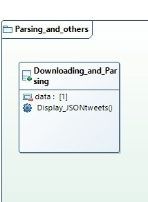

# Progetto_Marcucci-Celani
Progetto di programmazione a oggetti AA2020/2021

# Introduzione
La seguente applicazione è stata sviluppata dagli studenti Stefano Marcucci e Alessandro Celani.
Partendo da una lista di 50 tweets ha come scopo quello di fornire funzionalità di analisi dei tweet, inoltre l'applicazione  fornisce la possibilità di 
applicare dei filtri e delle statistiche sulle sorgenti, andando a evidenziare il loro andamento settimanale.

# Struttura
Il progetto è organizzato in package 

Come si puo vedere dal diagramma delle classi c'è la seguente struttura:
1. PackageController: all'interno è presente la classe controller che si occupa di gestire le interazioni con l'utente;

2. PackageException: all'interno sono presenti le eccezioni lanciate in caso si errori

3. PackageFilters: all' interno sono presenti tutte le classi che servono per implementare le funzionalità di filtraggio

4. PackageModels: all'interno sono presenti tutte le classi che servono al sistema per creare le strutture dati e le statistiche

5. PackageSarsing_and_others: all'interno è presente la classe che effettua il downloading e il parsing dei 50 tweets inserendoli in un arrayList

6: PackageStatistics: all'interno sono prenti le classi che servono per implementare le statistiche 

7: PackageUtils: all'interno sono presenti una classe che serve per implementare i filtri e una classe che effettua lo split della stringa created_at

Attraverso il seguente diagramma l'utente puo capire il funzionamento dell'applicazione e l'interazione di essa con l'utente.

# Descrizione
L'applicazione una volta avviata puo essere interrogata attraverso l'utilizzo dell applicativo Postman. 
E possibile inoltre effettuare operazioni di tipo GET e POST inserendo le seguenti rotte avremo un comportamento diverso e di conseguenza una risposta diversa  dall'applicazione
Ecco l'elenco delle operazioni possibili:
1. /GetTweets -->  questa è un operazione di tipo GET ,Se inseriamo questa rotta in postman ci verra restituita una lista di 50 tweets con relativi campi
2. /GetMetaData --> questa è un operazione di tipo GET ,Se inseriamo questa rotta in postman ci verrano restituiti i metadati 
3. /Filter --> questa è un operazione di tipo POST , Se inseriamo questa rotta in postman fornendo un opportuno body alla richiesta ci verranno restituiti i tweet filtrati
4. /DataStatistic -->questa è un operazione di tipo POST ,  Se inseriamo questa rotta in postman ci verrano restituite le  statistiche sulla data
5. /SourceStatistic -->questa è un operazione di tipo POST ,  Se inseriamo questa rotta in postman ci verranno restituite le statistiche sulla provenienza del tweet
